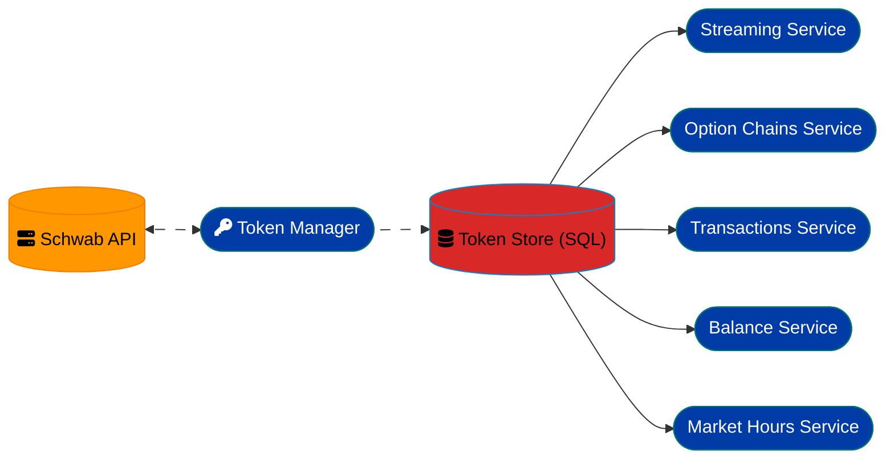
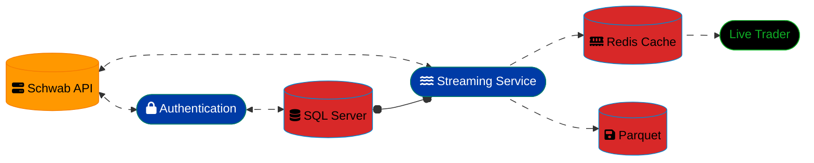
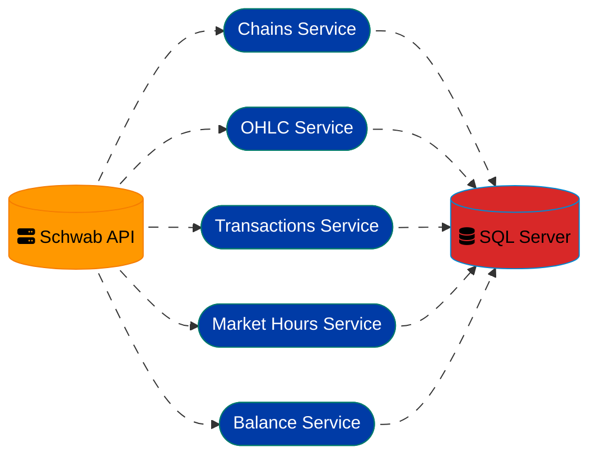

# Schwab ELT ETL Pipeline

A comprehensive data collection and processing pipeline for the Charles Schwab API, designed to capture real-time market data, option chains, transactions, and account information for analysis and trading operations. This is setup to use Microsoft SQL Server as the database. I run it directly on Ubuntu 22.04, be sure to setup the SQL Server agent, as you will need it for transforming the parquet data into Options ojects and subsequently into Veritcals.

> **Note**: This project does not use any imported schwab helper libraries at all. All connectiviy code is original and transparently contained within this project!

**[For some specific SQL ETL work examples](docs/sql_server.md)**

 <strong>Project Detail</strong>

- Authentication Service (tokens_service.py)
  - Handled independent of all other services
  - Access Token Every 30 minutes (set by Schwab)
  - Refresh Token Every 7 days (set by Schwab)
  - Token Management
    - OAuth2 Authentication
    - Automatic Access Token Refresh
    - Token Storage in SQL
- Config and Secrets
  - Config.yaml for application settings
  - .env for sensitive information (credentials, account numbers)
- Live Data Collection Services
  - Streaming Service - Use this for high frequency tick by tick data (schwab_stream.py)
    - Cached Live Prices in Redis
    - Piped Directly into Parquet files
    - Real-time symbol and options data
    - Underlying price data is also stored in redis and parquet
    - Automatic reconnection and count monitoring (schwab_stream_monitor.py, schwab_stream_controller.py)
    - Currently configured for 0 DTE SPX options
    - Symbols and Subscription details are configurable in config.yaml
  - Option Chains Service - Use this for snapshot pulls of live data
    - Multiple collection frequencies (1-min, 5-min, 30-min)
    - Various DTE ranges
    - SPX focused (expandable to other symbols)
- Historic Data Collection Services
  - OHLC Service - Use this for pulling historic price data
    - 1-minute and daily data
    - Configurable symbols (config.yaml)
    - Stored procedure for data processing and transformation
- Account Data Services
  - Transactions Service - Use this for monitoring account transactions
    - Raw JSON storage for complete audit trail in SQL (stores all transactions)
    - Structured data processing for vertical/spreads in SQL (stores identified verticals)
  - Balances Service - Use this for monitoring account balances
    - Daily balance and position updates
    - Stored in SQL for analysis
  - Market Hours Service - Use this for monitoring market hours
    - Updates market hours data in SQL
    - Provides foundation for other services' scheduling

 <strong>Security Notice</strong>

This system is designed for private use only. It is your sole responsibility to secure your data collection environment. At a minimum:

* **Do not expose any ports publicly.**
* Avoid direct remote access to this system from outside your local or VPN network.
* All services should be protected by firewall rules and run under restricted service accounts.
* Use `.env` files responsibly and never commit them to version control.
* Monitor your logs and token usage regularly for any unauthorized access.

> **This project assumes a hardened and secured deployment environment. Improper setup may expose sensitive account or trading data. Use at your own risk.**

 <strong>Investment Disclaimer</strong>

This software is provided for educational and analytical purposes only. It is **not intended as financial advice or a trading recommendation**. Use of any data collected or strategies derived from this software is done solely at your own discretion and risk.

The author is not responsible for any financial losses, performance outcomes, or regulatory compliance issues arising from the use of this codebase.

## Token Manager Pipeline

## WebSocket Pipeline

## Services Pipeline

##  Quick Start

1. **Setup Configuration**: Copy `.env.example` to `.env` and configure your credentials
2. **Install Dependencies**: `pip install -r requirements.txt`
3. **Initialize Database**: Run market hours setup and account hash generation
4. **Authenticate**: Manually run tokens_service.py to fetch and store OAuth2 tokens - it will prompt you to authenticate in your browser
5. **Start Services**: Use systemd or run services manually for data collection

##  What This Pipeline Does

This system continuously collects and processes financial data from the Schwab API:

- **Real-time Streaming**: Live SPX options and underlying price data via WebSocket
- **Option Chains**: Scheduled collection of SPX option chains with multiple frequencies and DTE ranges
- **OHLC Data**: Historical price data for specified symbols at 1-minute and daily intervals
- **Transactions**: Account transaction monitoring and processing
- **Account Data**: Balance and account information updates

> ** Important**: This pipeline currently has Pacific Time Zone hardcoded in `config.yaml`. All market hours and scheduling are based on US/Pacific timezone.

##  Project Structure

- **[`tools/`](docs/tools.md)** - Core reusable modules (DB, API client, utilities)
- **[`services/`](docs/services.md)** - Data collection services managed by systemd
- **[`scripts/`](docs/scripts.md)** - One-off utilities for setup and maintenance
- **[`docs/`](docs/)** - Detailed documentation for each component
- **[`sql/`](docs/database.md)** - Database schema and stored procedures

##  Documentation

### Setup & Configuration
- **[Setup Guide](docs/setup.md)** - Complete installation and configuration
- **[Configuration Reference](docs/configuration.md)** - Environment variables and config.yaml
- **[Database Setup](docs/database.md)** - Schema, tables, and stored procedures

### Components
- **[Services Overview](docs/services.md)** - All data collection services
- **[Tools & Modules](docs/tools.md)** - Core reusable components
- **[API Integration](docs/api.md)** - Schwab API authentication and endpoints

### Operations
- **[Running the Pipeline](docs/operations.md)** - Starting, monitoring, and troubleshooting
- **[Systemd Integration](docs/systemd.md)** - Service management and scheduling

##  Prerequisites

- Python 3.8+
- SQL Server database
- Schwab API credentials & Account (OAuth2 app registration)
- Gmail account for notifications (optional)

##  TODOs

- **Timezone Configuration**: Make timezone configurable instead of hardcoded Pacific Time in `config.yaml`
- **Multi-Symbol Chains**: Duplicate option chains collection for additional symbols beyond SPX

##  License

This project is for educational and personal use. Please ensure compliance with Schwab API terms of service.

This project is licensed under the MIT License - see the [LICENSE](./docs/LICENSE) file for details.

