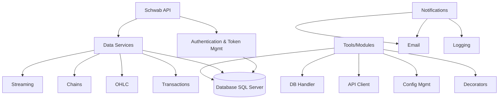

# Schwab ELT ETL Pipeline

A comprehensive data collection and processing pipeline for the Charles Schwab API, designed to capture real-time market data, option chains, transactions, and account information for analysis and trading operations. This is setup to use Microsoft SQL Server as the database. I run it directly on Ubuntu 22.04, be sure to setup the SQL Server agent, as you will need it for transforming the parquet data into Options ojects and subsequently into Veritcals.

## 🚀 Quick Start

1. **Setup Configuration**: Copy `.env.example` to `.env` and configure your credentials
2. **Install Dependencies**: `pip install -r requirements.txt`
3. **Initialize Database**: Run market hours setup and account hash generation
4. **Authenticate**: Manually run tokens_service.py to fetch and store OAuth2 tokens - it will prompt you to authenticate in your browser
5. **Start Services**: Use systemd or run services manually for data collection

## 📋 What This Pipeline Does

This system continuously collects and processes financial data from the Schwab API:

- **Real-time Streaming**: Live SPX options and underlying price data via WebSocket
- **Option Chains**: Scheduled collection of SPX option chains with multiple frequencies and DTE ranges
- **OHLC Data**: Historical price data for specified symbols at 1-minute and daily intervals
- **Transactions**: Account transaction monitoring and processing
- **Account Data**: Balance and account information updates

## 🏗️ Architecture Overview

> **⚠️ Important**: This pipeline currently has Pacific Time Zone hardcoded in `config.yaml`. All market hours and scheduling are based on US/Pacific timezone.

## 📁 Project Structure

- **[`tools/`](docs/tools.md)** - Core reusable modules (DB, API client, utilities)
- **[`services/`](docs/services.md)** - Data collection services managed by systemd
- **[`scripts/`](docs/scripts.md)** - One-off utilities for setup and maintenance
- **[`docs/`](docs/)** - Detailed documentation for each component
- **[`sql/`](docs/database.md)** - Database schema and stored procedures

## 📖 Documentation

### Setup & Configuration
- **[Setup Guide](docs/setup.md)** - Complete installation and configuration
- **[Configuration Reference](docs/configuration.md)** - Environment variables and config.yaml
- **[Database Setup](docs/database.md)** - Schema, tables, and stored procedures

### Components
- **[Services Overview](docs/services.md)** - All data collection services
- **[Tools & Modules](docs/tools.md)** - Core reusable components
- **[API Integration](docs/api.md)** - Schwab API authentication and endpoints

### Operations
- **[Running the Pipeline](docs/operations.md)** - Starting, monitoring, and troubleshooting
- **[Systemd Integration](docs/systemd.md)** - Service management and scheduling

## 🔧 Key Features

- **OAuth2 Authentication** with automatic token refresh
- **Market Hours Awareness** for intelligent scheduling
- **Robust Error Handling** with email notifications
- **Database Integration** with connection pooling
- **Configurable Scheduling** via environment variables
- **Real-time Streaming** with automatic reconnection
- **Comprehensive Logging** for monitoring and debugging

## 🛠️ Prerequisites

- Python 3.8+
- SQL Server database
- Schwab API credentials (OAuth2 app registration)
- Gmail account for notifications (optional)

## 📊 Data Collected

The pipeline captures:
- **SPX Option Chains** (1-min, 5-min, 30-min intervals)
- **Real-time Streaming** (options and underlying ticks)
- **OHLC Price Data** (minute and daily)
- **Account Transactions** (orders and executions)
- **Account Balances** and information
- **Market Hours** and trading sessions

## 🔒 Security

- Credentials stored in environment variables
- Database connection encryption
- Token-based API authentication
- No hardcoded secrets in code

## 📋 TODOs

- **Timezone Configuration**: Make timezone configurable instead of hardcoded Pacific Time in `config.yaml`
- **Multi-Symbol Chains**: Duplicate option chains collection for additional symbols beyond SPX

## 📝 License

This project is for educational and personal use. Please ensure compliance with Schwab API terms of service.

---

For detailed setup instructions, see the [Setup Guide](docs/setup.md).