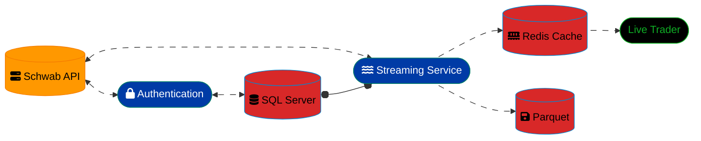

# SQL Server Market Data Ingestion into Data Warehouse

### Setup Information
Using a websocket, we collect live streaming data from the borkerage. That data is piped directly into parquet files. The data is also pushed directly into a **Redis cache**. This allows two purposes for the data. 

1. The data can be used for **live trading**, as it is pushed to the Redis cache.
2. The data can be used for **historical analysis**, as it is pushed to the parquet files.

## WebSocket Pipeline

> Note: for detailed information on the Authentication service, please refer to the [README](../README.md).

Below is a specific example from data to vertical time series.

### Parquet Bulk Insert (Bronze)
Below you will find the initial ingestion into Bronze.  You will notice, the logging is quite simple as is the error checking. This is primarily due to the way I handle logging. I am using systemctl and journalctl (both tools build into Ubuntu), for logging and alerting and service control.  With a simply print to screen and the ETL SP executed by python, the output is sent to the journal with relevant run details from the python file.

```sql
-- =============================================
-- Stored Procedure: SP_IMPORT_PARQUET
-- =============================================
-- Author:          Bobby Whitehead
-- Create Date:     06/03/2025
-- Last Modified:   06/23/2025
-- 
-- Description:     Imports daily parquet files containing SPX options quotes
--                  into a staging table for further processing. Supports both
--                  scheduled daily imports and manual historical data imports.
--
-- Parameters:
--   @D           DATE            - Target date for parquet file import (yyyy-MM-dd)
--   @RootPath    NVARCHAR(100)   - Base directory path where parquet files are stored
--
-- Expected File Format:
--   {RootPath}/parquet/quotes_{yyyy-MM-dd}.parquet
--
-- Target Table:
--   SPX_OPT.SPX.PARQUET_STAGE - Staging table for imported parquet data
--
-- Dependencies:
--   - OPENROWSET with PARQUET format support
--   - Appropriate permissions on file system path
--   - SPX_OPT database and SPX schema
--
-- Usage Examples:
--   -- Import today's parquet file
--   EXEC SPX.SP_IMPORT_PARQUET @D = '2025-06-23', @RootPath = 'C:\Data'
--   
--   -- Import historical parquet file
--   EXEC SPX.SP_IMPORT_PARQUET @D = '2025-06-20', @RootPath = 'C:\Data'
--
-- Notes:
--   - Procedure drops and recreates PARQUET_STAGE table on each run
--   - Data is ordered by received_at DESC for most recent quotes first
--   - Error handling is minimal for integration with Python logging system
--   - Designed to work with journalctl logging for monitoring
-- =============================================

ALTER PROCEDURE [SPX].[SP_IMPORT_PARQUET]
    @D DATE,
    @RootPath NVARCHAR(100)
AS
BEGIN
    SET NOCOUNT ON;
    
    -- =============================================
    -- Variable Declarations
    -- =============================================
    DECLARE @fileDate   VARCHAR(10);        -- Formatted date string (yyyy-MM-dd)
    DECLARE @filePath   NVARCHAR(255);      -- Complete path to parquet file
    DECLARE @sql        NVARCHAR(MAX);      -- Dynamic SQL statement
    
    -- =============================================
    -- Data Preparation
    -- =============================================
    
    -- Clean up existing staging table
    -- Note: Using DROP instead of TRUNCATE to handle schema changes
    IF OBJECT_ID('SPX_OPT.SPX.PARQUET_STAGE', 'U') IS NOT NULL
        DROP TABLE SPX_OPT.SPX.PARQUET_STAGE;
    
    -- Format the input date to match parquet file naming convention
    SET @fileDate = CONVERT(VARCHAR(10), @D, 23);  -- ISO format: yyyy-MM-dd
    
    -- Construct the complete file path
    -- Expected format: {RootPath}/parquet/quotes_{yyyy-MM-dd}.parquet
    SET @filePath = @RootPath + '/parquet/quotes_' + @fileDate + '.parquet';
    
    -- =============================================
    -- Parquet Import Process
    -- =============================================
    
    BEGIN TRY 
        -- Build dynamic SQL for OPENROWSET parquet import
        -- Using dynamic SQL to handle variable file paths
        SET @sql = N'
            SELECT *
            INTO SPX_OPT.SPX.PARQUET_STAGE
            FROM OPENROWSET(
                BULK ''' + @filePath + ''',
                FORMAT = ''PARQUET''
            ) AS parquet_data
            ORDER BY received_at DESC;
        ';
        
        -- Execute the dynamic import statement
        EXEC sp_executesql @sql;
        
        -- Optional: Add success logging if needed
        -- PRINT('Successfully imported parquet file: ' + @filePath);
        
    END TRY
    BEGIN CATCH
        -- Minimal error handling for Python integration
        -- Error details are captured by the calling Python process
        -- and logged through journalctl for monitoring alerts
        PRINT('Issue with Parquet import for file: ' + @filePath);
        
        -- Optionally re-throw the error for debugging
        -- THROW;
        
    END CATCH
    
END

```
> NOTE: Removing try/catch, logging and vertically compressed scripting for readability going forward.

### Transforming into market objects (options, symbols) (Silver)
This is an example procedure that ingests from the parquet staging table. The websocket side of this (the collector) has a data cleansing layer. The data at this point is mostly pristine. This section parses data into Option Objects (OPT) and Option Time Series OPTM, in a perfect 1NF-3NF format. The only repeating data is the OPT_ID.

The final merge is more to do with multiple options data sources (several brokerages, with varying quality assignments).

```sql
-- =============================================
-- Stored Procedure: SP_IMPORT_PARQUET_OPT_DATA
-- =============================================
-- Author:          Bobby Whitehead
-- Create Date:     06/03/2025
-- Last Modified:   06/23/2025
--
-- Description:     Processes parquet staging data to extract and normalize
--                  SPX options information into structured tables. Parses
--                  option symbols, creates unique option records, and
--                  maintains time series data for option marks.
--
-- Parameters:      None - operates on SPX_OPT.SPX.PARQUET_STAGE
--
-- Source Table:
--   SPX_OPT.SPX.PARQUET_STAGE - Raw parquet data from SP_IMPORT_PARQUET
--
-- Target Tables:
--   SPX_OPT.SPX.OPT  - Master table of unique options (Strike, CP, Expiry)
--   SPX_OPT.SPX.OPTM - Time series data for option marks
--
-- Dependencies:
--   - dbo.ParseSPXSymbol_ITVF()     - Function to parse SPX option symbols
--   - dbo.EpochMsToPST_ITVF()       - Function to convert epoch ms to PST
--   - SPX_OPT.SPX.PARQUET_STAGE     - Source staging table
--   - SPX_OPT.SPX.OPT               - Options master table
--   - SPX_OPT.SPX.OPTM              - Options time series table
--
-- Processing Logic:
--   1. Extract unique options from parquet data (excluding $SPX index)
--   2. Insert new options into OPT master table
--   3. Process time series data with PST conversion
--   4. Filter trading hours (06:30 - 13:00 PST)
--   5. Upsert aggregated marks into OPTM table
--
-- Data Quality Rules:
--   - Excludes $SPX index symbol
--   - Requires non-null Strike, CP (Call/Put), and Expiry
--   - Requires non-null Mark ([37]) and Timestamp ([38])
--   - Filters to market hours (06:30 - 13:00 PST)
--   - Uses MAX(Mark) for duplicate timestamps
--
-- Usage Example:
--   EXEC SPX.SP_IMPORT_PARQUET_OPT_DATA
--
-- Notes:
--   - Designed to run after SP_IMPORT_PARQUET
--   - Uses MERGE for efficient upsert operations
--   - Handles timezone conversion from epoch milliseconds to PST
--   - Aggregates multiple marks per timestamp using MAX()
-- =============================================

ALTER PROCEDURE [SPX].[SP_IMPORT_PARQUET_OPT_DATA]
AS
BEGIN
    SET NOCOUNT ON;

    -- =============================================
    -- Step 1: Extract Unique Options
    -- =============================================
    -- Parse option symbols and identify unique option contracts
    -- Excludes the $SPX index and groups by option characteristics

    WITH CTE_OPT AS (
        SELECT
            Strike,
            CP,                     -- Call/Put indicator
            Expiry
        FROM SPX_OPT.SPX.PARQUET_STAGE A
        CROSS APPLY dbo.ParseSPXSymbol_ITVF(A.symbol) D
        WHERE A.symbol <> '$SPX'    -- Exclude SPX index, focus on options
        GROUP BY Strike, CP, Expiry, A.symbol
    )

    -- =============================================
    -- Step 2: Insert New Options into Master Table
    -- =============================================
    -- Add any new option contracts that don't already exist
    -- Ensures data quality with non-null validation

    INSERT INTO SPX_OPT.SPX.OPT (Strike, CP, Expiry)
    SELECT
        O.Strike,
        O.CP,
        O.Expiry
    FROM CTE_OPT O
    LEFT JOIN SPX_OPT.SPX.OPT B
        ON B.CP = O.CP
        AND B.Expiry = O.Expiry
        AND B.Strike = O.Strike
    WHERE B.Strike IS NULL                  -- New option not in master table
        AND O.Strike <> 0                   -- Valid strike price
        AND O.CP IS NOT NULL                -- Valid call/put indicator
        AND O.Expiry IS NOT NULL;           -- Valid expiration date

    -- =============================================
    -- Step 3: Process Time Series Data
    -- =============================================
    -- Convert timestamps, parse symbols, and prepare mark data
    -- Filters to market hours and aggregates by timestamp

    WITH CTE_SRC AS (
        SELECT
            R.pst AS ReceivedAt,            -- When data was received (PST)
            symbol,
            [37] AS Mark,                   -- Option mark/price
            T.pst AS T,                     -- Quote timestamp (PST)
            D.*                             -- Parsed symbol components
        FROM SPX_OPT.SPX.PARQUET_STAGE A
        CROSS APPLY dbo.EpochMsToPST_ITVF(A.received_at) R
        CROSS APPLY dbo.EpochMsToPST_ITVF(A.[38]) T
        CROSS APPLY dbo.ParseSPXSymbol_ITVF(A.symbol) D
        WHERE A.symbol <> '$SPX'            -- Options only
            AND A.[37] IS NOT NULL          -- Valid mark data
            AND A.[38] IS NOT NULL          -- Valid timestamp
    ),
    CTE_OPTM AS (
        SELECT
            B.OPT_ID,
            A.T,
            MAX(A.Mark) AS Mark             -- Aggregate multiple marks per timestamp
        FROM CTE_SRC A
        INNER JOIN SPX_OPT.SPX.OPT B
            ON B.Expiry = A.Expiry
            AND B.CP = A.CP
            AND B.Strike = A.Strike
        WHERE CAST(A.T AS TIME(0)) BETWEEN '06:30' AND '13:00'  -- Market hours PST
        GROUP BY B.OPT_ID, A.T
    )

    -- =============================================
    -- Step 4: Upsert Time Series Data
    -- =============================================
    -- Efficiently insert new records or update existing ones
    -- Uses MERGE for optimal performance with large datasets

    MERGE INTO SPX_OPT.SPX.OPTM AS Target
    USING (
        SELECT
            OPT_ID,
            T,
            Mark AS O                       -- Renamed for target table compatibility
        FROM CTE_OPTM
    ) AS Source
        ON Target.OPT_ID = Source.OPT_ID
        AND Target.T = Source.T
    WHEN NOT MATCHED BY TARGET THEN
        INSERT (OPT_ID, T, O)
        VALUES (Source.OPT_ID, Source.T, Source.O);

    -- Optional: Add row count logging for monitoring
    -- PRINT('Options processed: ' + CAST(@@ROWCOUNT AS VARCHAR(10)));

END
```

### Transforming into Verticals (Gold)

```sql
-- =============================================
-- Stored Procedure: SP_PROCESS_VERTS
-- =============================================
-- Author:          Bobby Whitehead
-- Create Date:     03/29/2024
-- Last Modified:   06/23/2025
--
-- Description:     Creates 0 DTE (Days to Expiration) vertical spreads for a given
--                  trading day. Processes option time series data to construct
--                  vertical spread combinations and their pricing time series.
--                  Includes outlier detection and data quality filtering.
--
-- Parameters:
--   @D           DATE        - Target expiration date for vertical processing
--   @MinTime     TIME(0)     - Start time for processing window (e.g., '10:00')
--   @W           INT         - Width of vertical spread in strike increments
--
-- Target Tables:
--   SPX_VERT.SPX.VERT       - Master table of vertical spread definitions
--   SPX_VERT.SPX.VERT_TS    - Time series data for vertical spread pricing
--
-- Dependencies:
--   - SPX_OPT.SPX.UL                           - Underlying SPX price data
--   - SPX_VERT.SPX.SP_OPTION_TIMESERIES_BACKFILL - Backfill procedure
--   - SPX_VERT.SPX.TEMP_OPTION_TIMESERIES      - Temporary option data
--
-- Processing Logic:
--   1. Determine SPX price range for the trading day
--   2. Execute backfill procedure to create continuous time series
--   3. Construct vertical spreads by pairing short/long options
--   4. Apply outlier detection using moving averages
--   5. Insert new vertical definitions and time series data
--
-- Data Quality Features:
--   - Outlier detection using 5-period moving averages
--   - Price boundary validation (0 <= price <= width)
--   - Market hours filtering (until 13:00 PST)
--   - Duplicate prevention with LEFT JOIN patterns
--
-- Usage Examples:
--   -- Process 5-point verticals for May 29, 2025 starting at 10:00 AM
--   EXEC SPX.SP_PROCESS_VERTS @D = '2025-05-29', @MinTime = '10:00', @W = 5
--
--   -- Process 10-point verticals for current date starting at 09:30 AM
--   EXEC SPX.SP_PROCESS_VERTS @D = GETDATE(), @MinTime = '09:30', @W = 10
--
-- Performance Notes:
--   - Uses temporary tables for complex transformations (more efficient than CTEs)
--   - Implements windowing functions for outlier detection
--   - Bulk operations with GROUP BY for efficiency
--   - Strategic indexing on OPT_ID, T, and VID recommended
--
-- Business Rules:
--   - Only processes 0 DTE options (same-day expiration)
--   - Strike prices rounded to nearest $5 increment
--   - Vertical width determined by @W parameter
--   - Outliers filtered using ±0.5 threshold from moving averages
-- =============================================

ALTER PROCEDURE [SPX].[SP_PROCESS_VERTS]
    @D DATE,
    @MinTime TIME(0),
    @W INT
AS
BEGIN
    SET NOCOUNT ON;

    -- =============================================
    -- Variable Declarations & Cleanup
    -- =============================================
    -- Clean up any existing temporary tables from previous runs
    DROP TABLE IF EXISTS #SHORT_OPTS, #LONG_OPTS, #BOTH_OPTS,
                         #BOTH_OPTS_EM, #BOTH_OPTS_EM_UL,
                         #BOTH_OPTS_OUTLIERS_UL, #FINAL;

    -- Note: Using temp tables instead of CTEs/table variables for performance
    -- Complex transformations with large datasets benefit from temp table indexing

    DECLARE @Expiry DATE = @D;                  -- Target expiration date
    DECLARE @SPX_Min DECIMAL(9,2);              -- Minimum SPX price for range
    DECLARE @SPX_Max DECIMAL(9,2);              -- Maximum SPX price for range
    DECLARE @OPT_Range INT = 30;                -- Option strike range parameter

    -- =============================================
    -- Step 1: Determine SPX Price Range
    -- =============================================
    -- Calculate min/max SPX prices for the day to establish strike range
    -- Rounds to nearest $5 increment for standard option strikes

    SELECT
        @SPX_Min = CAST(ROUND(MIN(Mark)/5, 0) * 5 AS INT),
        @SPX_Max = CAST(ROUND(MAX(Mark)/5, 0) * 5 AS INT)
    FROM SPX_OPT.SPX.UL
    WHERE CAST(T AS DATE) = @Expiry
        AND CAST(T AS TIME(0)) BETWEEN @MinTime AND DATEADD(HOUR, 2, @MinTime);

    -- =============================================
    -- Step 2: Process Verticals (Main Logic)
    -- =============================================

    IF @SPX_Min IS NOT NULL
    BEGIN
        -- =============================================
        -- Step 2a: Backfill Time Series Data
        -- =============================================
        -- Create continuous time series for option pricing
        -- Fills gaps between price updates (e.g., 2.35 at 10:05:01, 2.40 at 10:06:01)
        -- Essential for accurate multi-leg option strategy pricing

        EXEC SPX_VERT.SPX.SP_OPTION_TIMESERIES_BACKFILL
            @Expiry, @MinTime, @SPX_Min, @SPX_Max, @OPT_Range, @W;

        -- =============================================
        -- Step 2b: Construct Vertical Spreads
        -- =============================================
        -- Merge short and long option legs to create vertical spread combinations
        -- Uses FULL OUTER JOIN to capture all possible vertical combinations

        SELECT
            S.Expiry,
            S.T,
            S.CP,
            S.OPT_ID AS SID,                    -- Short option ID
            L.OPT_ID AS LID,                    -- Long option ID
            S.SS,                               -- Short strike
            L.SS AS LS,                         -- Long strike
            S.SO,                               -- Short option price
            L.LO,                               -- Long option price
            (S.SO - L.LO) AS O,                 -- Net vertical price
            IIF(S.CP = -1, S.SS - L.SS, L.SS - S.SS) AS W  -- Vertical width
        INTO #BOTH_OPTS
        FROM SPX_VERT.SPX.TEMP_OPTION_TIMESERIES S
        FULL OUTER JOIN SPX_VERT.SPX.TEMP_OPTION_TIMESERIES L
            ON L.T = S.T
            AND S.CP = L.CP
            AND ((S.SS = L.SS + @W AND S.CP = -1) OR (S.SS = L.SS - @W AND S.CP = 1))
        WHERE L.T = S.T;

        -- =============================================
        -- Step 2c: Outlier Detection
        -- =============================================
        -- Identify and flag pricing outliers using moving averages
        -- Compares current price to 5-period before/after averages

        SELECT *,
            CASE
                WHEN ((AvgPre - A.O > 0.5 AND AvgFol - A.O > 0.5)
                   OR (A.O - AvgPre > 0.5 AND A.O - AvgFol > 0.5)) THEN 1
                ELSE 0
            END AS OI                           -- Outlier Indicator
        INTO #BOTH_OPTS_OUTLIERS_UL
        FROM (
            SELECT A.*,
                CAST(AVG(O) OVER(
                    PARTITION BY SID, LID
                    ORDER BY T ASC
                    ROWS BETWEEN 5 PRECEDING AND 1 PRECEDING
                ) AS DECIMAL(9,2)) AS AVGPRE,   -- 5-period preceding average
                CAST(AVG(O) OVER(
                    PARTITION BY SID, LID
                    ORDER BY T ASC
                    ROWS BETWEEN 1 FOLLOWING AND 5 FOLLOWING
                ) AS DECIMAL(9,2)) AS AVGFOL    -- 5-period following average
            FROM #BOTH_OPTS A
        ) A;

        -- =============================================
        -- Step 2d: Insert New Vertical Definitions
        -- =============================================
        -- Add unique vertical spread definitions to master table

        INSERT INTO SPX_VERT.SPX.VERT (SID, LID, SS, W, CP, Expiry)
        SELECT A.SID, A.LID, A.SS, A.W, A.CP, A.Expiry
        FROM (
            SELECT SID, LID, SS, W, CP, Expiry
            FROM #BOTH_OPTS_OUTLIERS_UL
            GROUP BY SID, LID, SS, W, CP, Expiry
        ) A
        LEFT JOIN SPX_VERT.SPX.VERT B
            ON B.SID = A.SID AND B.LID = A.LID
        WHERE B.SID IS NULL;

        -- =============================================
        -- Step 2e: Prepare Final Time Series Data
        -- =============================================
        -- Apply price boundaries and filter outliers for clean time series

        SELECT A.*
        INTO #FINAL
        FROM (
            SELECT
                C.VID,
                A.T,
                CASE
                    WHEN A.O < 0 THEN 0         -- Floor at zero
                    WHEN A.O > A.W THEN A.W     -- Cap at vertical width
                    ELSE A.O                    -- Use actual price
                END AS O
            FROM #BOTH_OPTS_OUTLIERS_UL A
            INNER JOIN SPX_VERT.SPX.VERT C
                ON C.SID = A.SID AND C.LID = A.LID
            WHERE CAST(A.T AS TIME(0)) <= '13:00'   -- Market hours filter
                AND OI <> 1                         -- Exclude outliers
        ) A
        LEFT JOIN SPX_VERT.SPX.VERT_TS B
            ON B.VID = A.VID AND B.T = A.T
        WHERE B.VID IS NULL;                        -- Only new records

        -- =============================================
        -- Step 2f: Insert Time Series with Rolling Average
        -- =============================================
        -- Final insert with 10-period rolling average calculation

        INSERT INTO SPX_VERT.SPX.VERT_TS
        SELECT X.VID, X.T, X.O, X.AVG_R
        FROM (
            SELECT
                VID,
                T,
                MAX(O) AS O,                    -- Handle any remaining duplicates
                MAX(AVG_R) AS AVG_R             -- 10-period rolling average
            FROM (
                SELECT
                    F.*,
                    CAST(AVG(O) OVER(
                        PARTITION BY F.VID
                        ORDER BY F.T ASC
                        ROWS BETWEEN 10 PRECEDING AND CURRENT ROW
                    ) AS DECIMAL(9,2)) AS AVG_R
                FROM #FINAL F
            ) Z
            GROUP BY VID, T
        ) X
        LEFT JOIN SPX_VERT.SPX.VERT_TS TS
            ON TS.T = X.T AND TS.VID = X.VID
        WHERE TS.T IS NULL;                     -- Prevent duplicates

    END
    ELSE
    BEGIN
        -- =============================================
        -- Error Handling: Missing Data
        -- =============================================
        PRINT 'MISSING DAILY DATA FOR ' + CAST(@Expiry AS VARCHAR(30));
    END

END
```